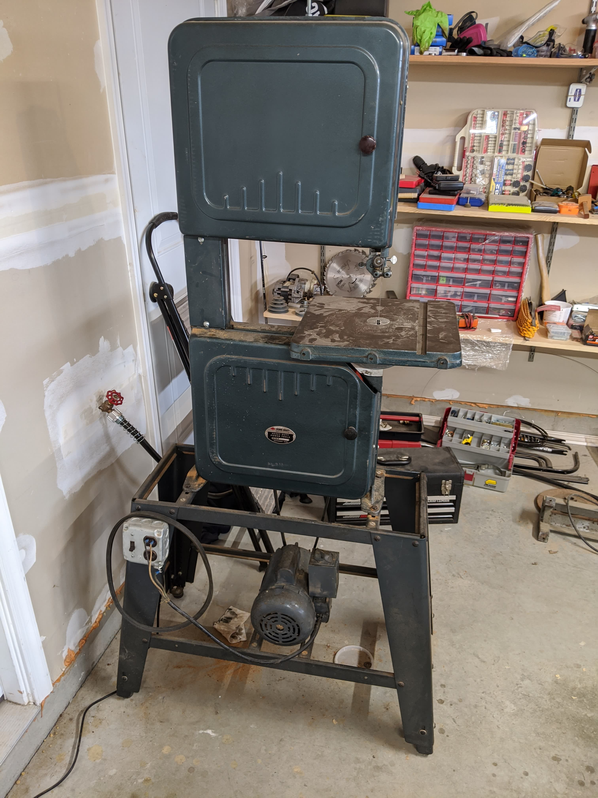
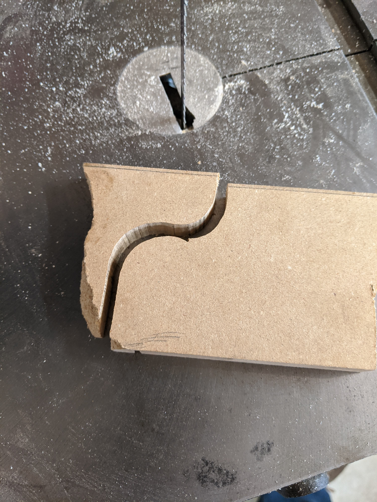
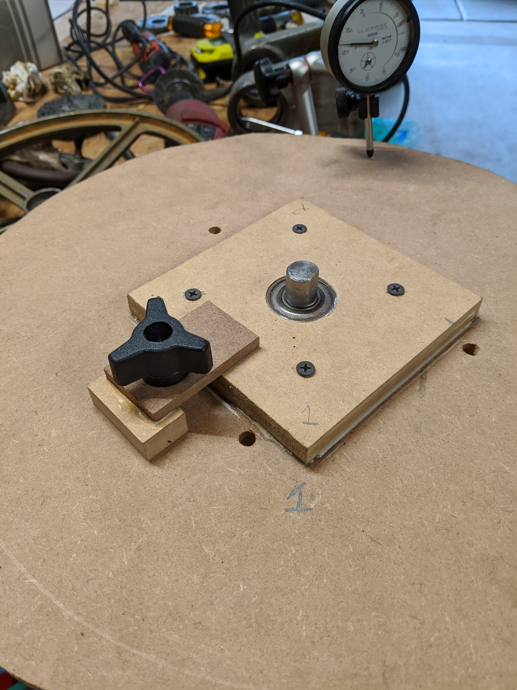
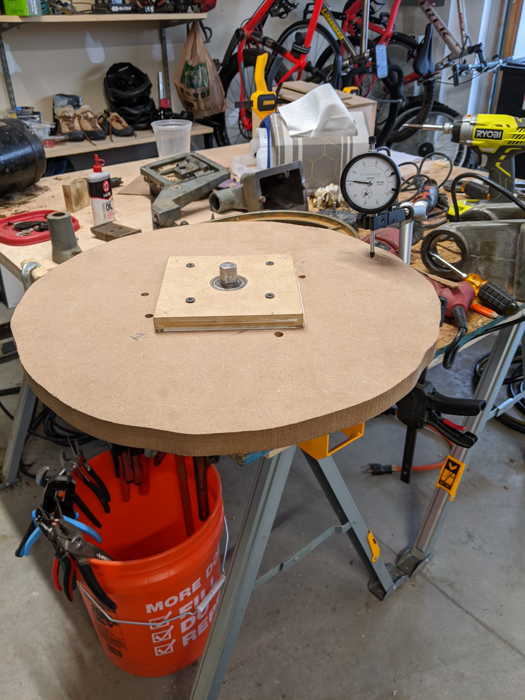
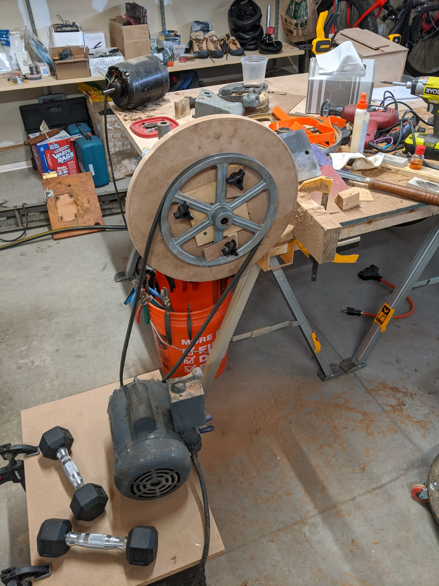
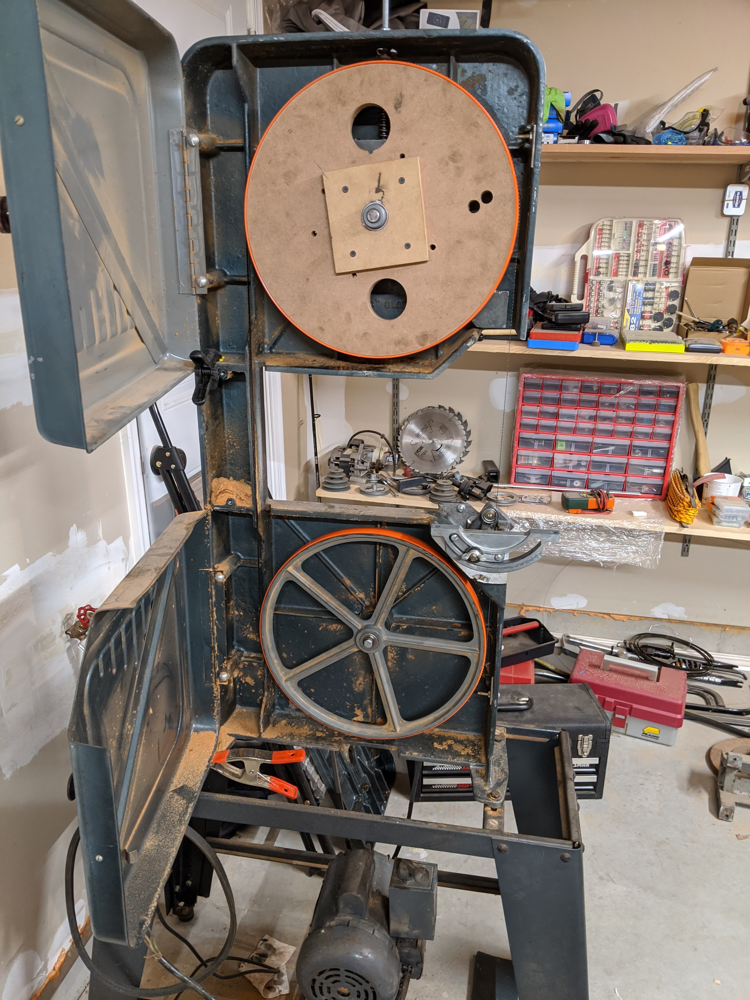
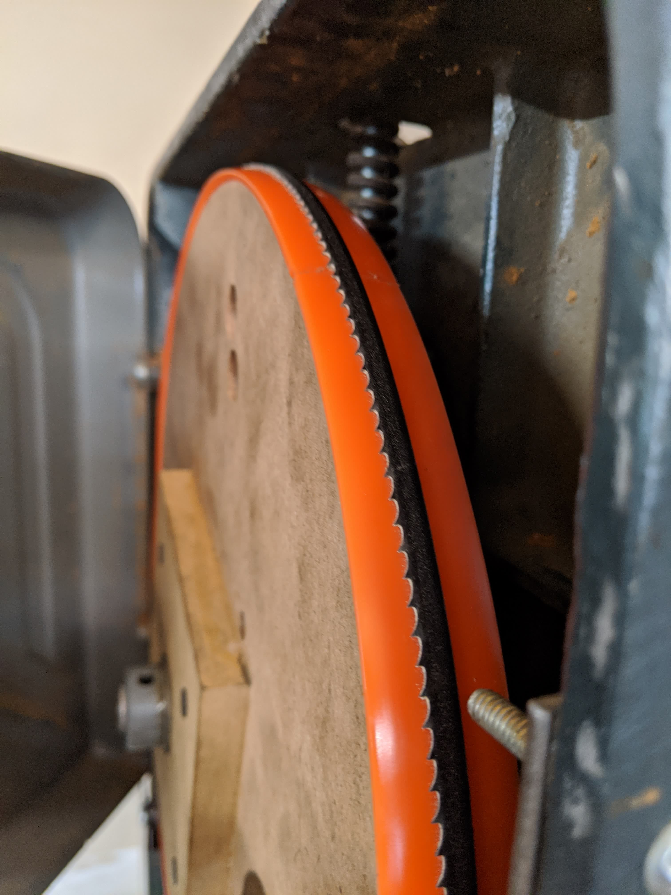
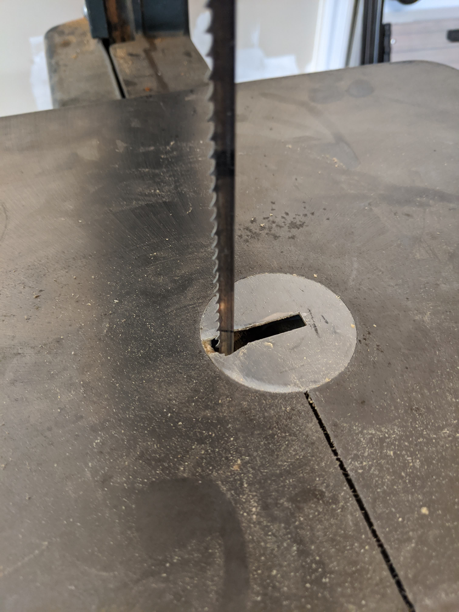
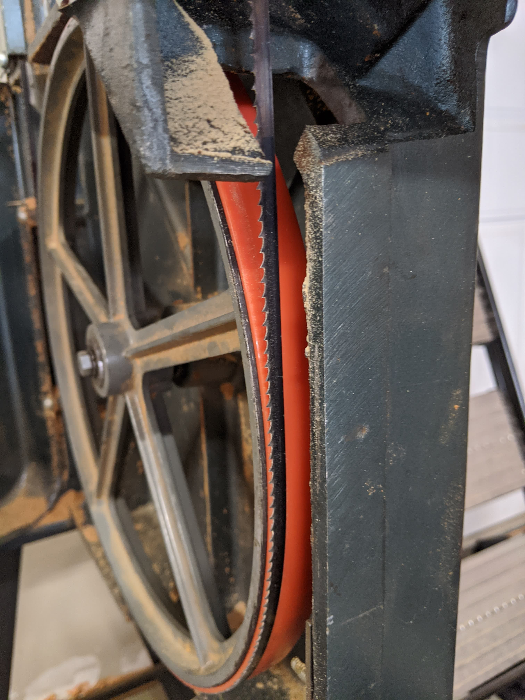
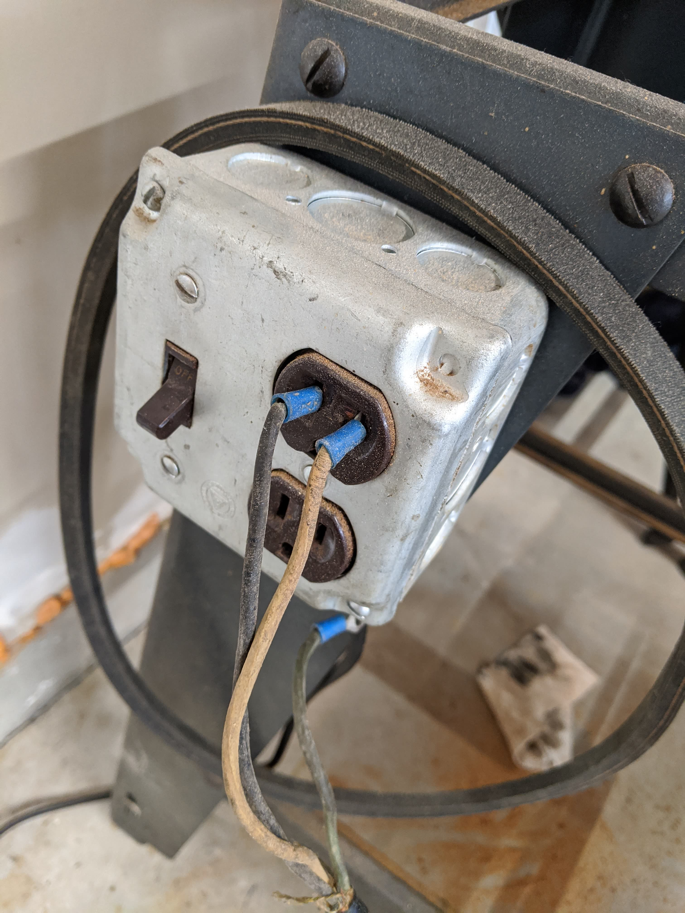




<!--more-->

I did end up using this monstrosity for a few months but ultimately replaced
it. Mainly because it vibrated, and the motor I had on it didn't go the right
speed. I also feel much better about using a saw that has OEM replacement parts
available, and has a smaller footprint (which makes rolling it around my shop
easier).

When I got this, I didn't do a good job vetting it and the blade tracked but
there was a significant wobble. From what I could tell, this was because the
top wheel was bent. Being a cast aluminum part for a bandsaw made 70
years ago, I couldn't easily get a replacement for less than what I paid for
the saw as a whole. I also couldn't easily fix it.

So I made a replacement wheel out of thick MDF.









It _did_ actually work, but the blade was _way_ too far forward (pictured
below). I did spend some time after this picture was taken getting it to track
further back, which involved thinning the glued on piece so the top wheel could
sit further back.









Not pictured is some more electrical work I did to make the switch a bit less
sketchy.

I was never able to get this to a point where I really felt safe using it.
Which is ultimately why I got rid of it, and replaced it with a newer (but
still 30 years old) 14" grizzly.
