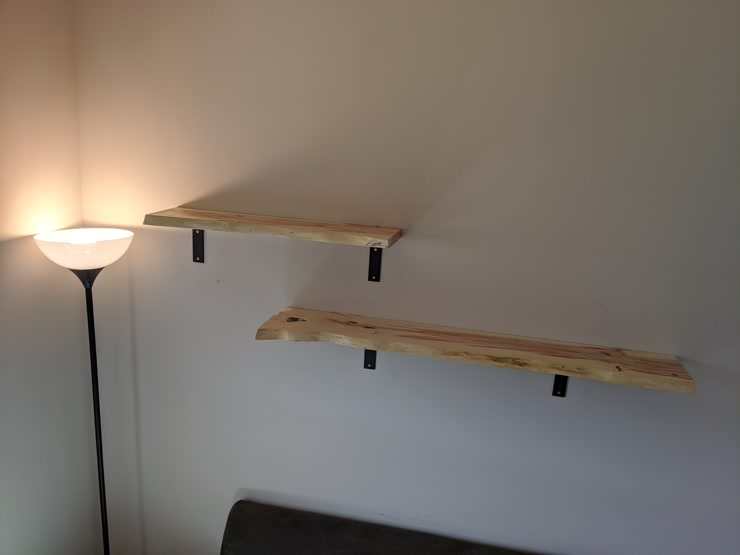

_Finished_

<table>
  <tbody>
    <tr>
      <td style="width: 50%;">
		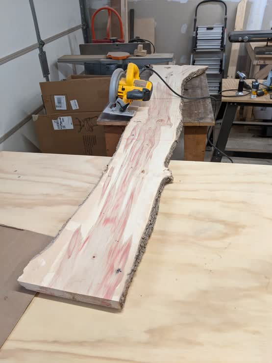
	  </td>
      <td style="padding-left: 10px; text-align: top;">
		

			I started with a long piece of box elder, which looks like it was
			cut right from the center of the tree. The first step was cutting
			it into two pieces, each of which would become a shelf. My circular
			saw didn't quite make it through, so I used a hand saw to finish it
			off.
		

		

			Once they were to length, I chose which side would become the live
			edge and cut the other side straight.
		

		

			With one straight side on each board, next was pulling off all the
			bark. This was a real pain to do, and was really messy. I wasn't
			able to pull off any large chunks at a time, as it didn't separate
			very well in the interior portion. My workaround was to use a very
			rough wood file to take off most of it, went at it with a wire
			brush on my drill to get the rest of it. There was a pretty clear
			point where the wood got much harder, so it wasn't too difficult to
			avoid gouging into the edge.
		

	  </td>
    </tr>
  </tbody>
</table>

:-------------------------:|:-------------------------:
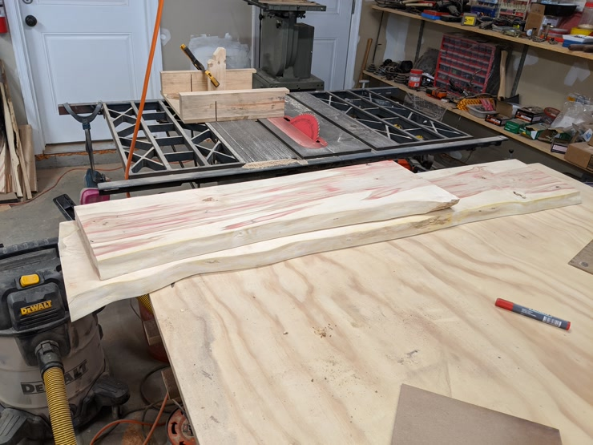 | 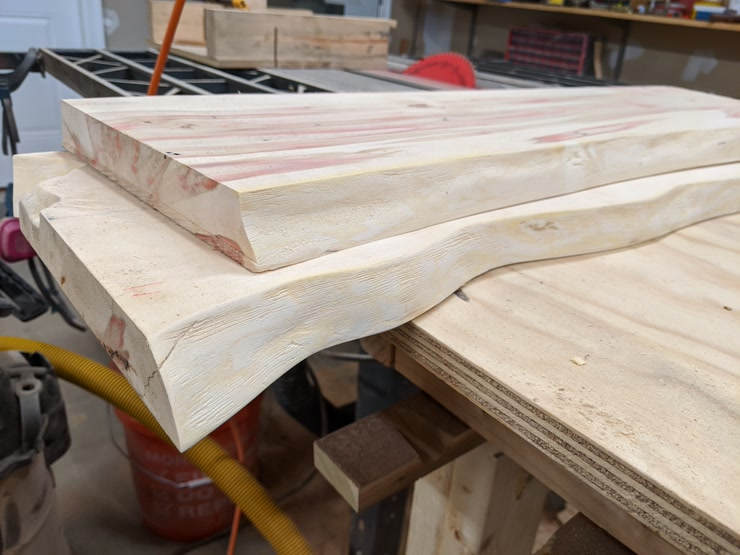

Next came filling in some of the voids with expoxy. Aluminum tape and
disposable measuring cups make epoxy work so much easier.

:-------------------------:|:-------------------------:
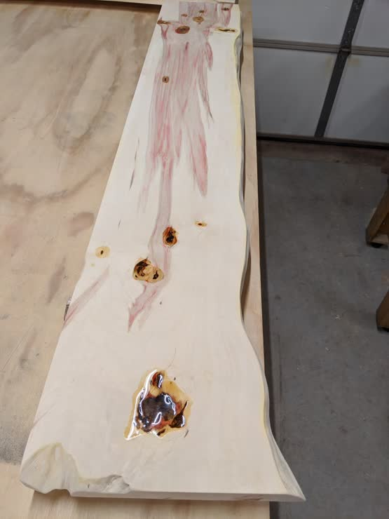 | 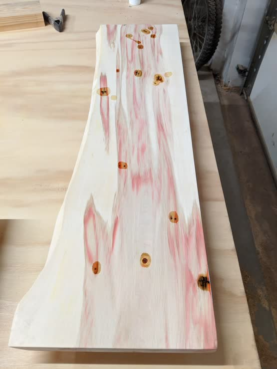

Then just lots of passes sanding and finishing.

:-------------------------:|:-------------------------:
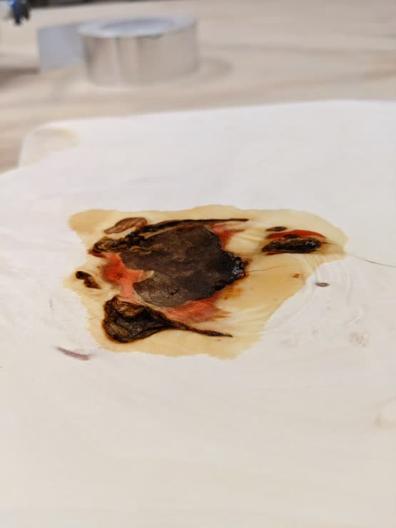 | 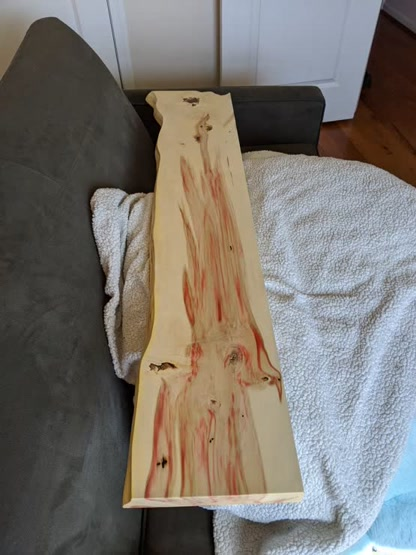

The shelves themselves were then done, and I installed them into some studs
using thick matte black angle brackets.

:-------------------------:|:-------------------------:
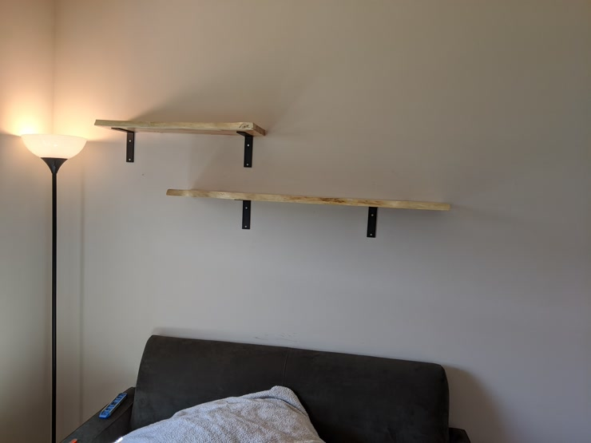 | 

:-------------------------:|:-------------------------:
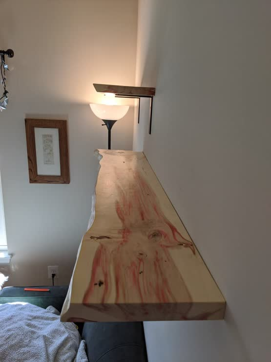 | 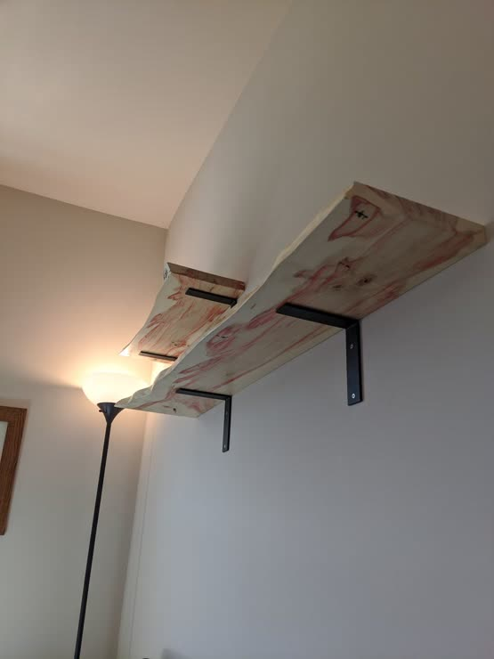
