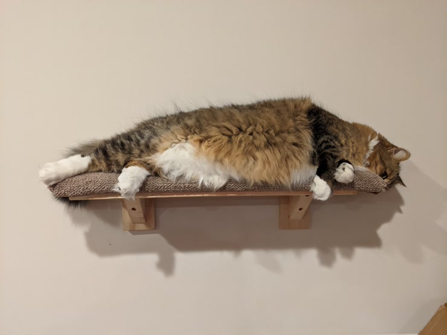
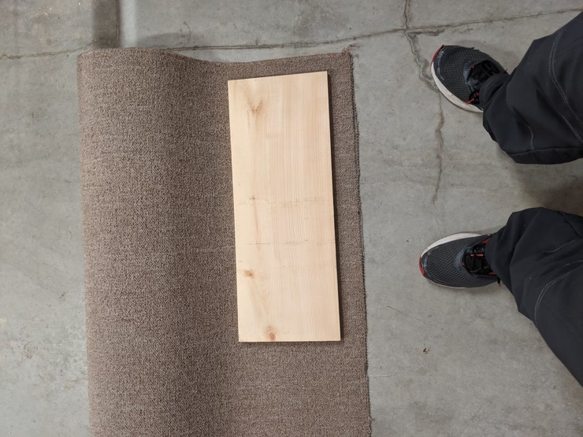
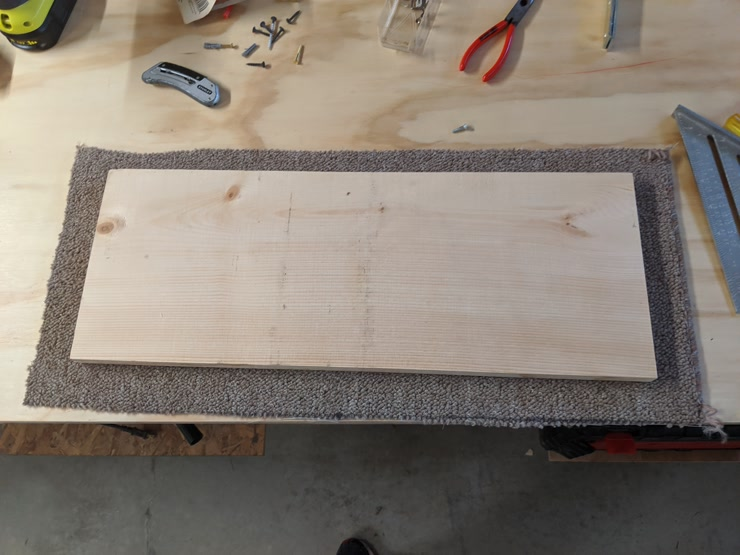
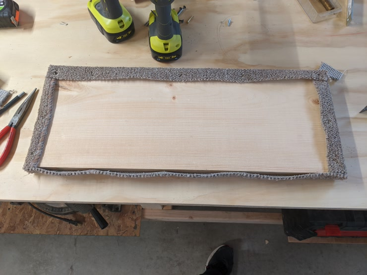
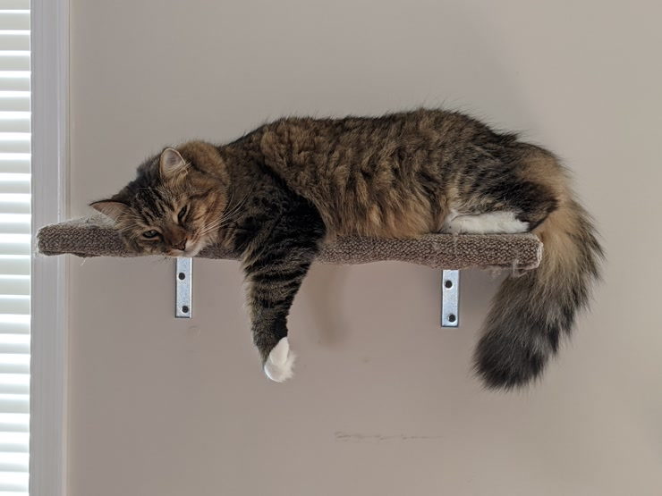
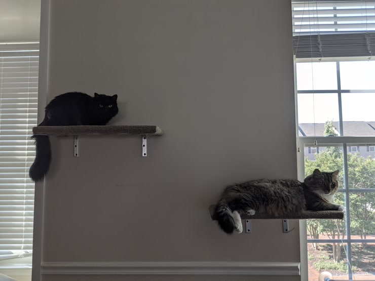
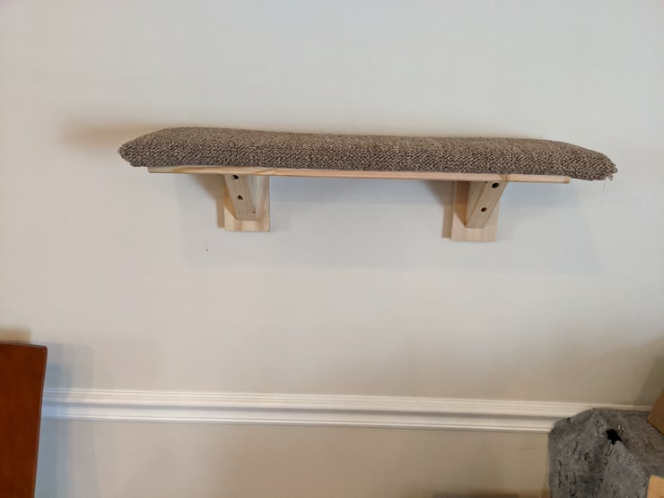
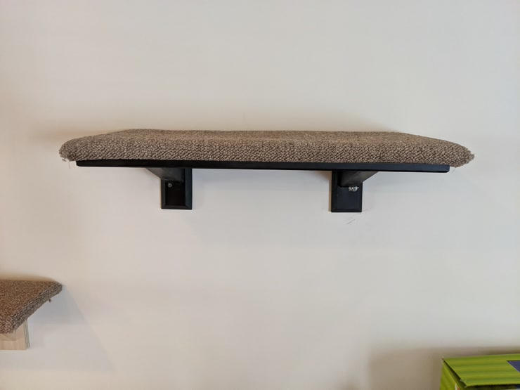
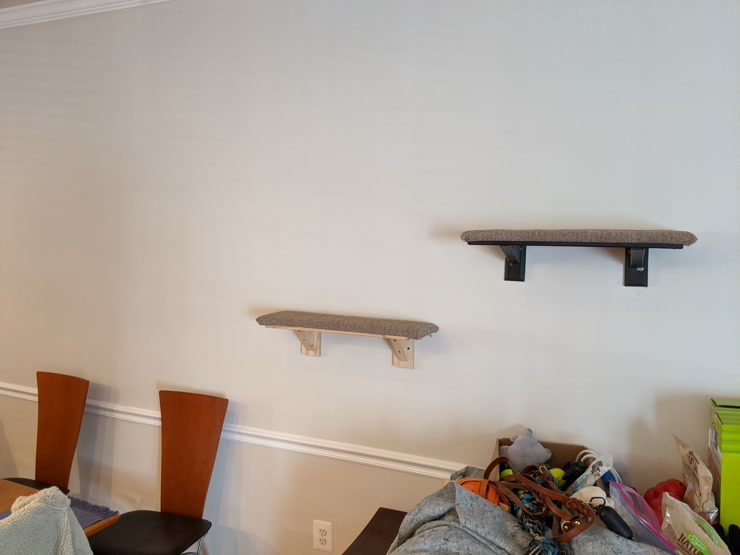

<!--more-->

_Finished, lazy cat :)_

I've gone through a few iterations on cat shelves that come together easily in
an afternoon. Here's a few different versions.

The most basic version was just 1x12, cut to length, covered with carpet, then
hung with simple L brackets.





This actually seemed to work out pretty well. The carpet was a pretty good
texture for the cats to scratch at, and they loved the height. The only issue
was that the carpet would come up a little bit around the edges sometimes, and
the brackets weren't quite up to handling Theo's chonk without flexing. For
the most part they were fine, but when he jumped between them there was some
noticable give.





So, some time later I revisted the design and mocked up something slightly
better. I don't really have progress pictures since it was just a quick
afternoon project, but there were two main modifications:
* The brackets were now made of wood (which is actually significantly stronger than the metal).
* The carpet was secured around the bottom with thin wooden strips, which when screwed down act as clamps.

The first one I did was just a quick mockup (though we left it up), then the
next one I painted to make it look a little more finished.





And they love it!




