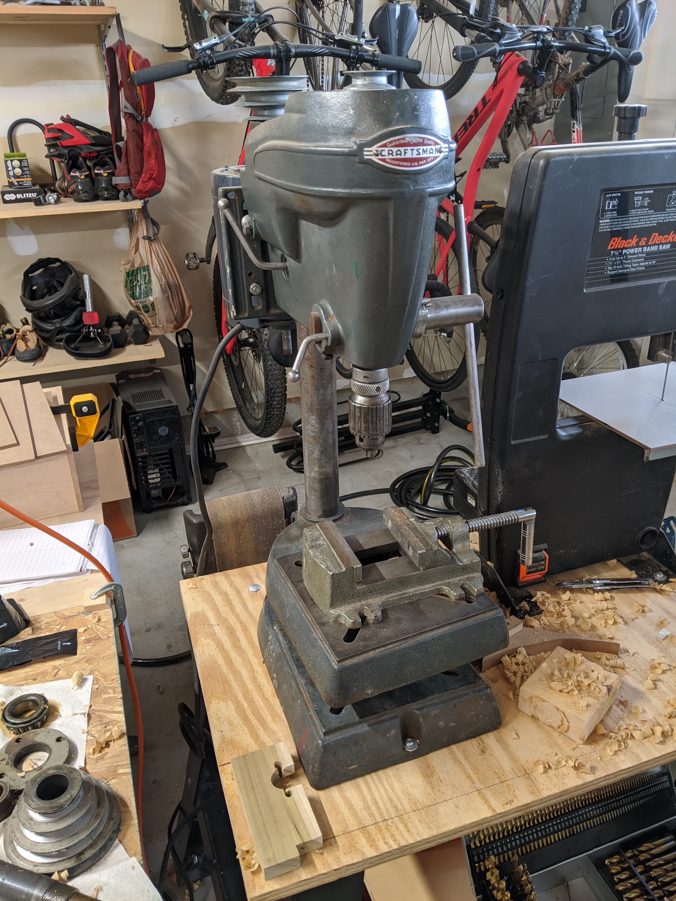
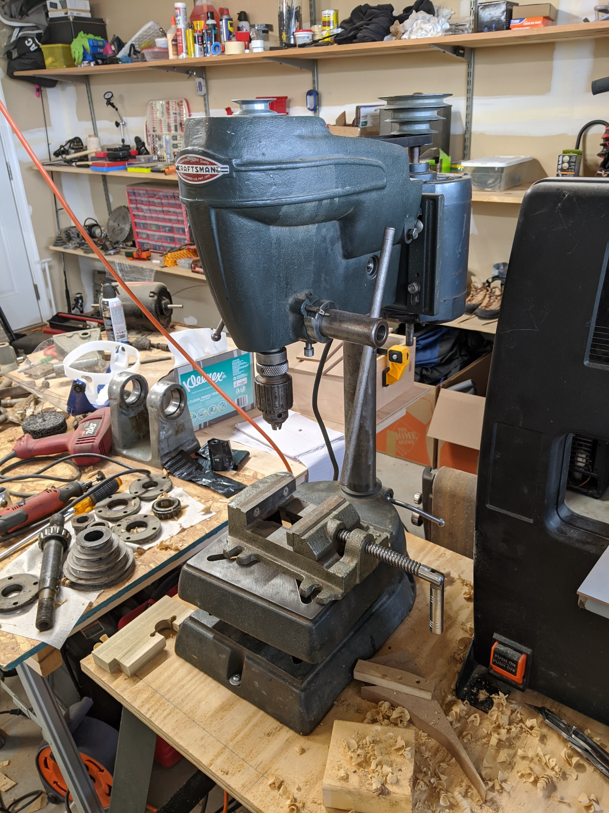
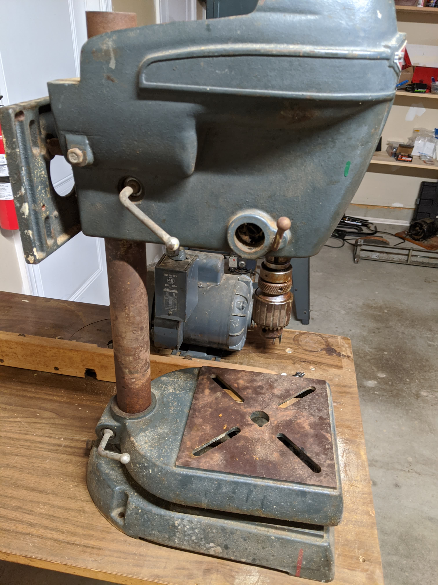
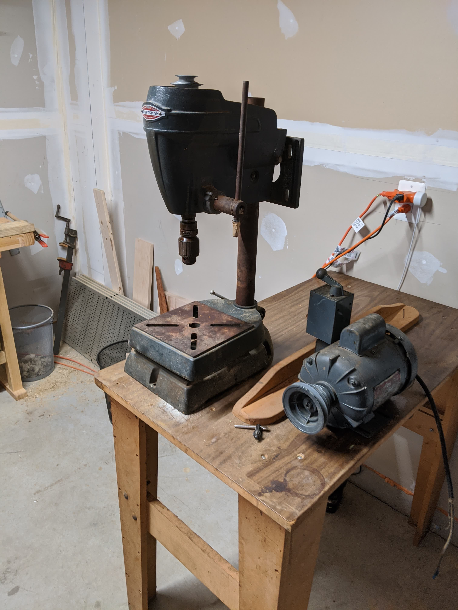
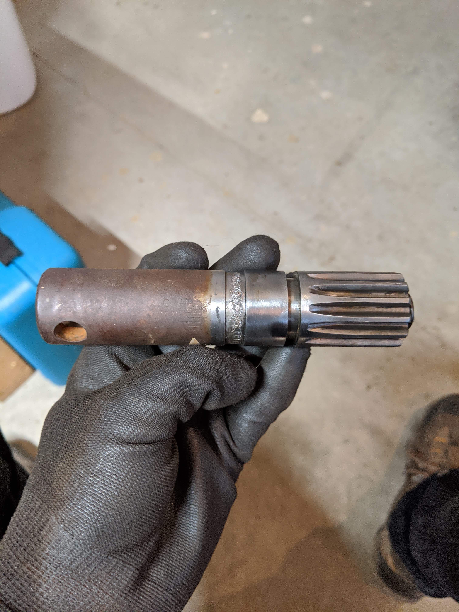
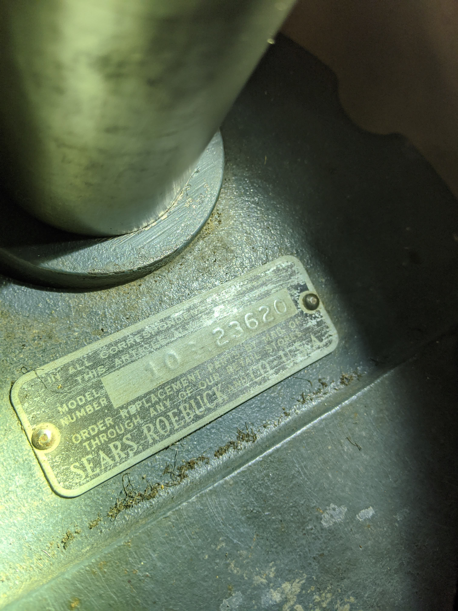
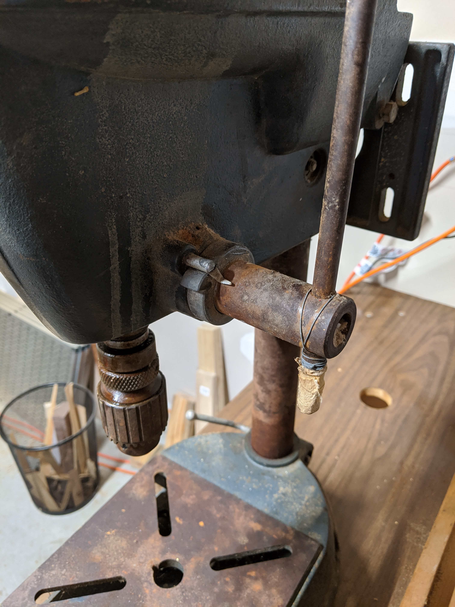
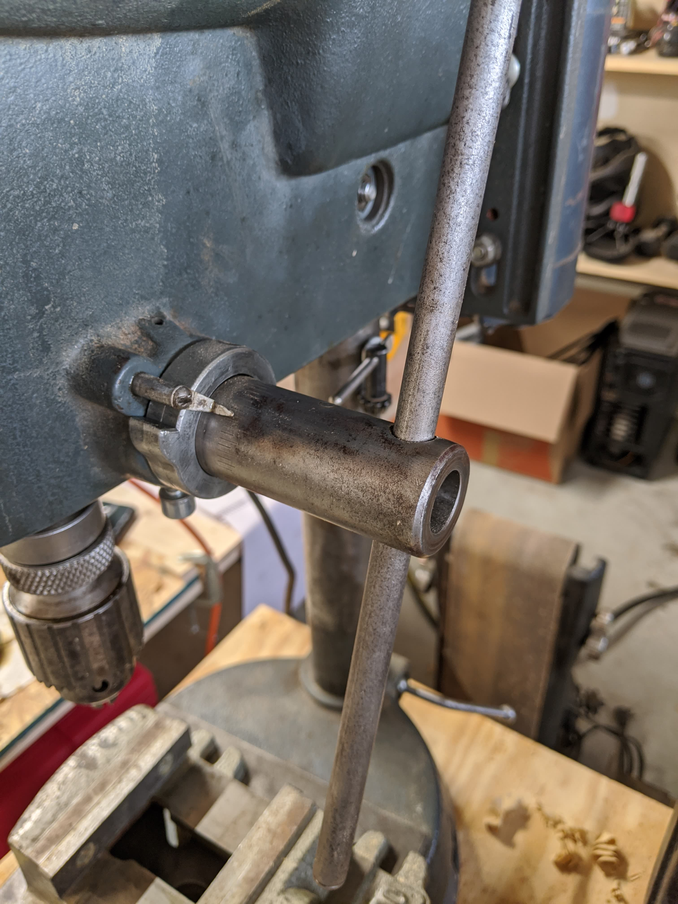
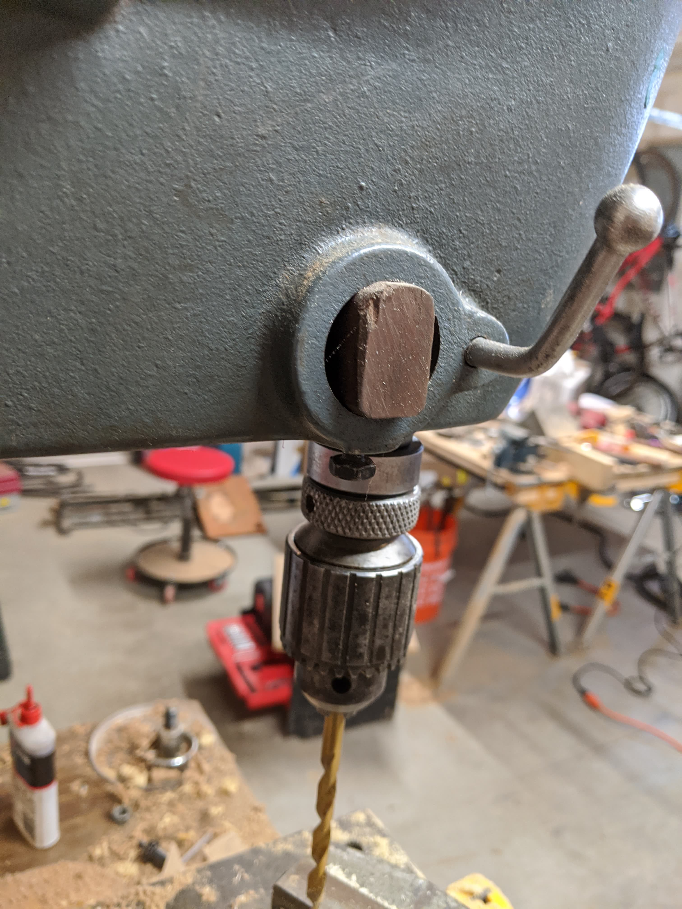
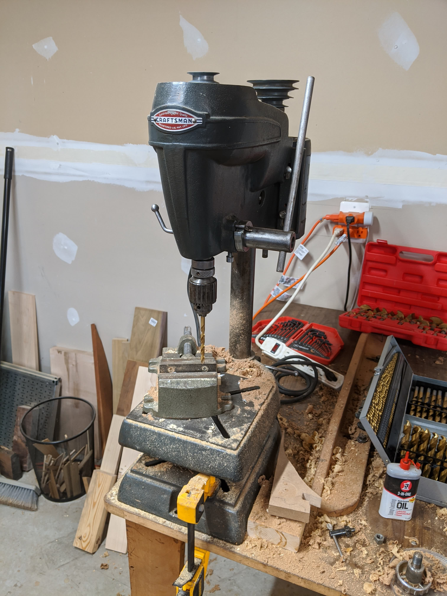





<!--more-->

_After._ [Manual](10323620.pdf)

When I picked this up it was not is superb condition. Covered in rust, parts didn't actually move, etc. I also later discovered that a few parts were missing.





The motor this came with is shown on the right. Upon closer inspection, this was definitely not the right one for this press. It's a huge and heavy 1.5-2hp motor that runs in both directions. I swapped in a different motor later. The press itself was also pretty far from usable. The rust stuck _everything_ together. Even though some of these parts are made of aluminium, the rust filled all the gaps that used to slide freely. Nothing really moved.

So I started cleaning it up, and was even able to find a serial number which led to a [manual](10323620.pdf) and more information about its manufacture [date](http://vintagemachinery.org/photoindex/detail.aspx?id=31400) (apparently 1948-1952).





_(left) Half way through restoring the pinion_

After a full disassembly, the parts could be stripped of rust with some oil and a wire brush. I used a couple bits on my dremel and drill to speed up the process.





Looks like the previous owner hacked the lever into staying put instead of fixing the spring mechanism. Much better after cleaning and fixing the internal spring's tension.

It also turned out that the feed return knob was missing, which meant the feed return spring had nothing to push against. I carved a piece of scrap hardwood, which seems to work well enough.





And that's about it. The motor probably needs to be replaced with one that runs slower, but works well enough for now. Sketchy drill press > no drill press.




