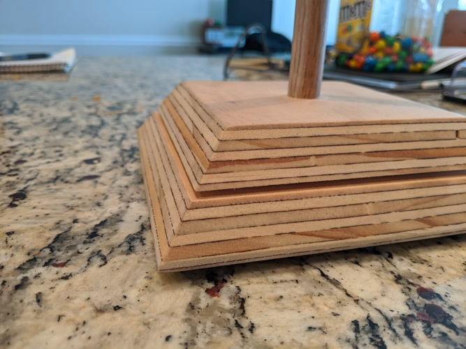
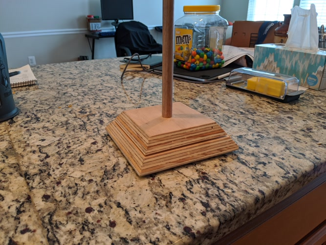
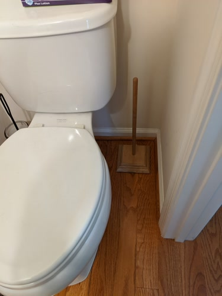
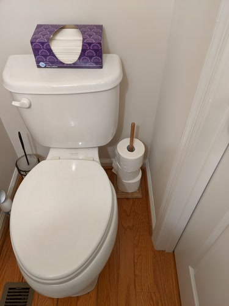

:-------------------------:|:-------------------------:
 | 

Another afternoon project made with scraps. One of our bathrooms is a small
half-bath with no cabinets. To avoid a _shitty_ situation, I put a dowel into
a square plywood base with chamfered edges. I put a coat of laquer on, and
some felt feet to raise it off the ground.  Now we can keep a few extra rolls
on-hand at all times.

This was a pretty simple project, so no in-progress pictures.

:-------------------------:|:-------------------------:
 | 
