:-------------------------:|:-------------------------:
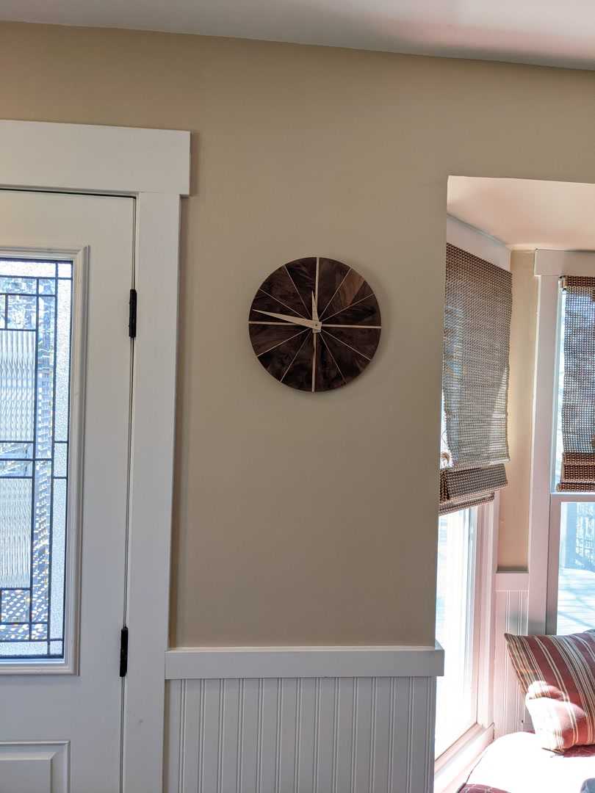 | 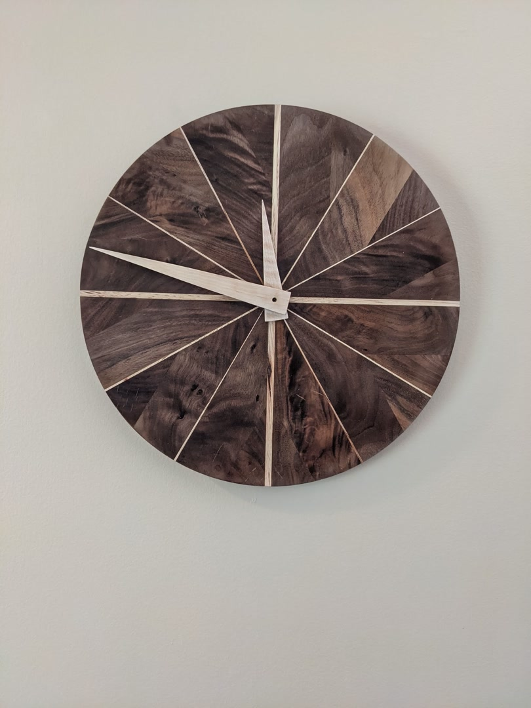

_Finished_

I started with a thrift store clock, which I was going to make some minor
improvements to. Turns out it ballooned and I ended up remaking the entire
clock.

:-------------------------:|:-------------------------:
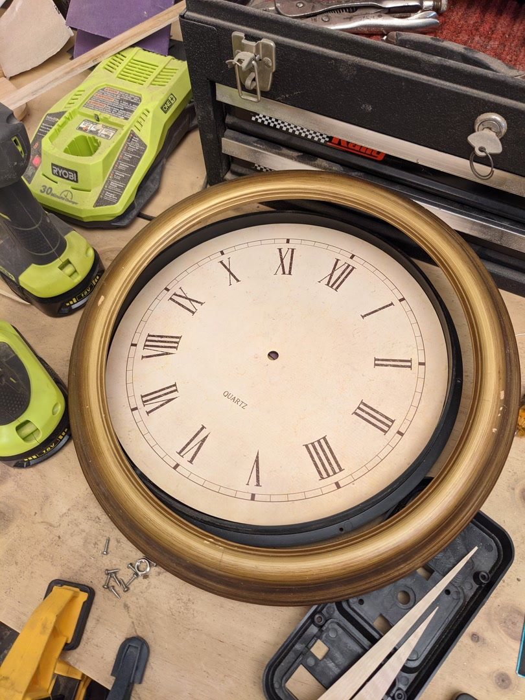 | 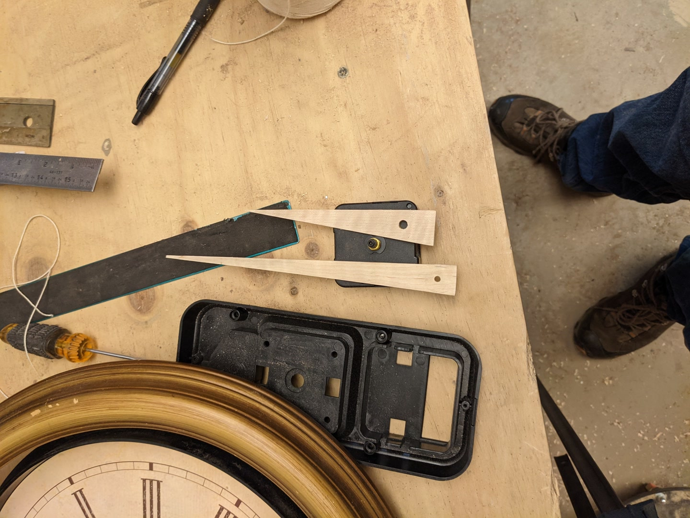

:-------------------------:|:-------------------------:
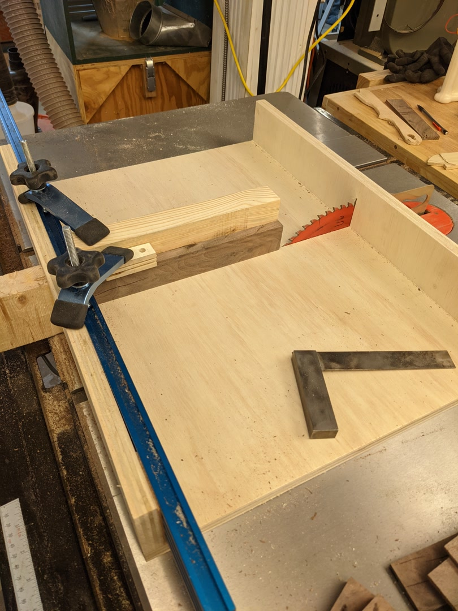 |  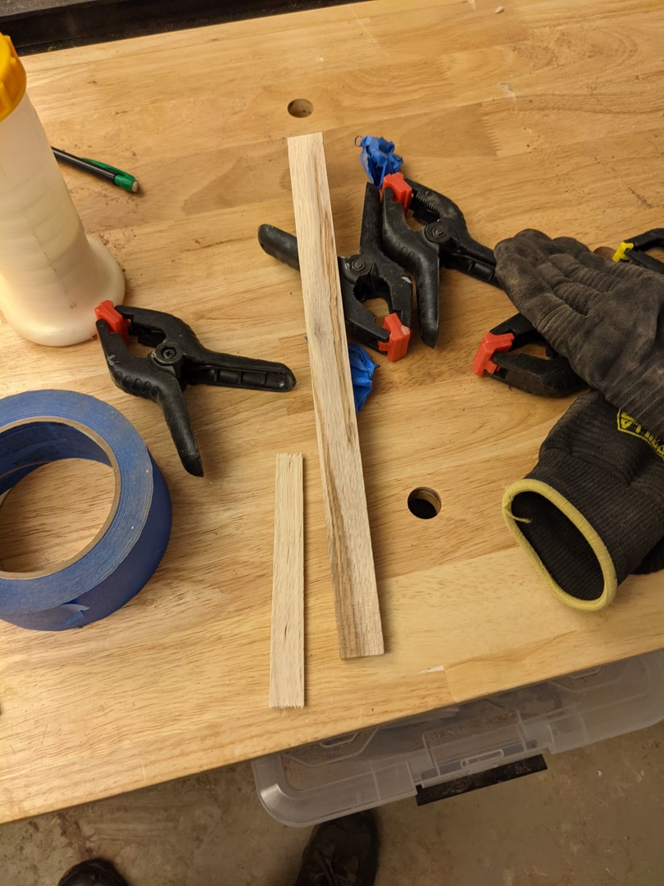

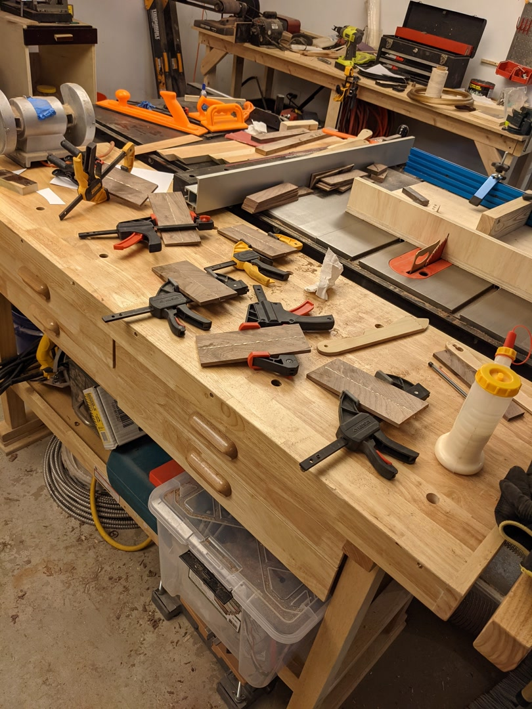
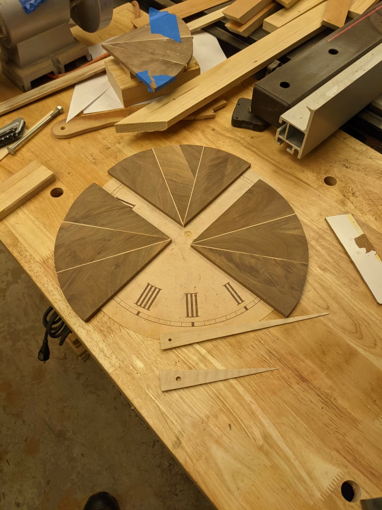
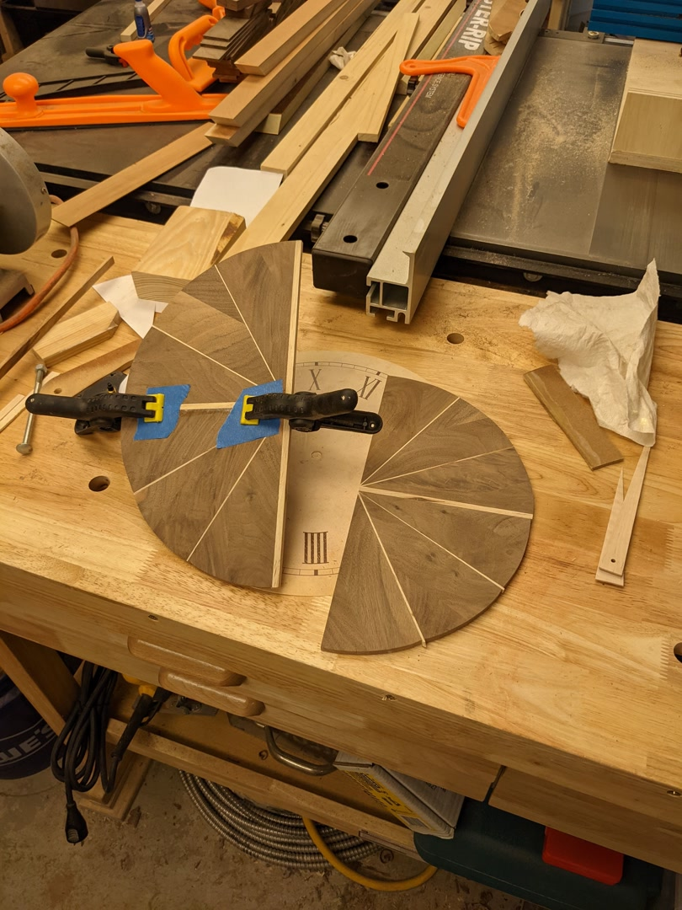

:-------------------------:|:-------------------------:
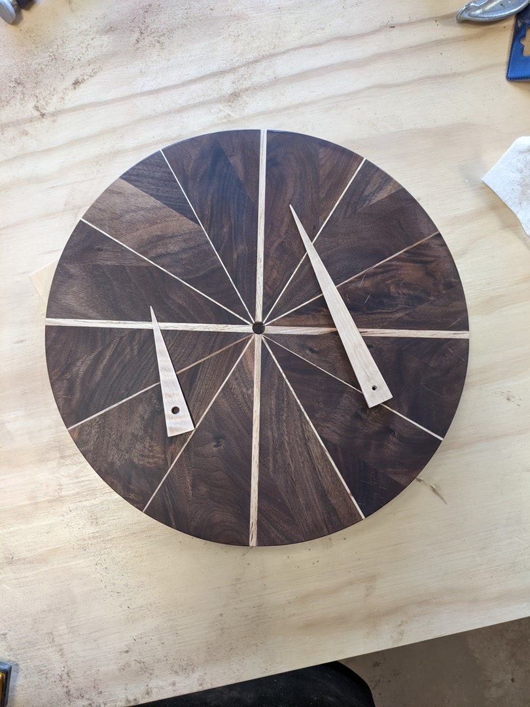 | 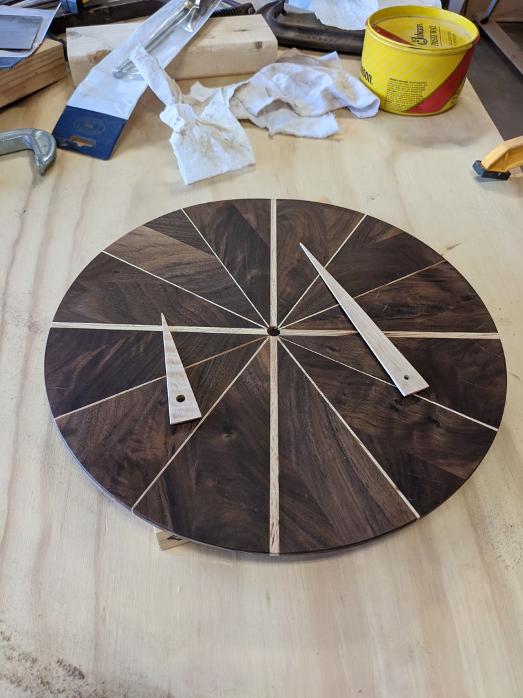

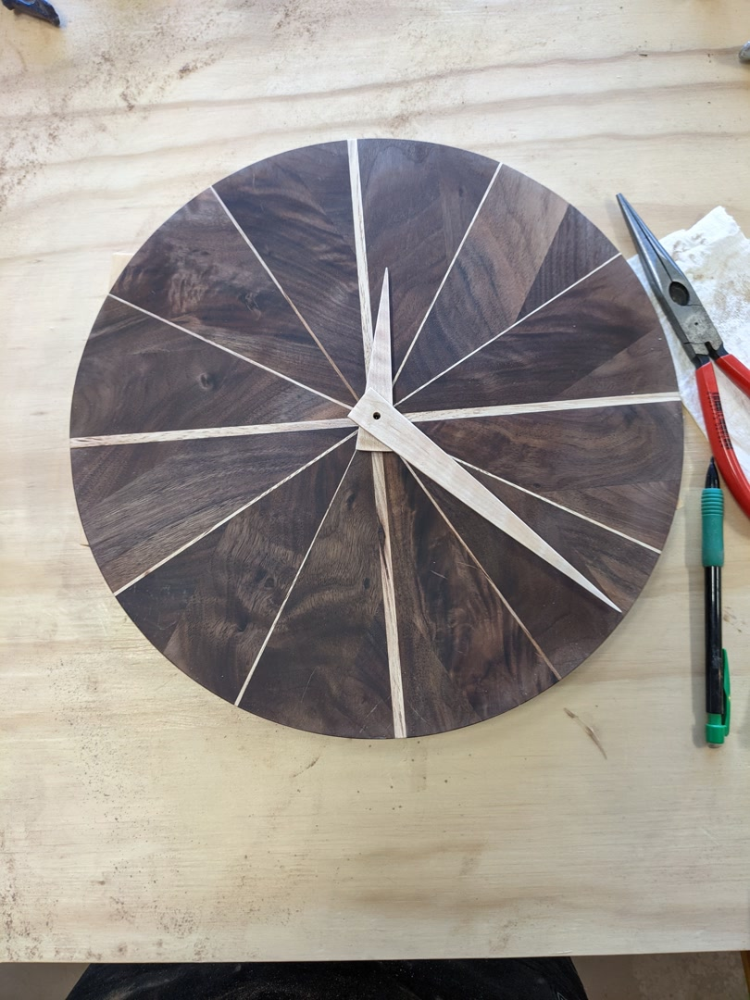

:-------------------------:|:-------------------------:
 | 
