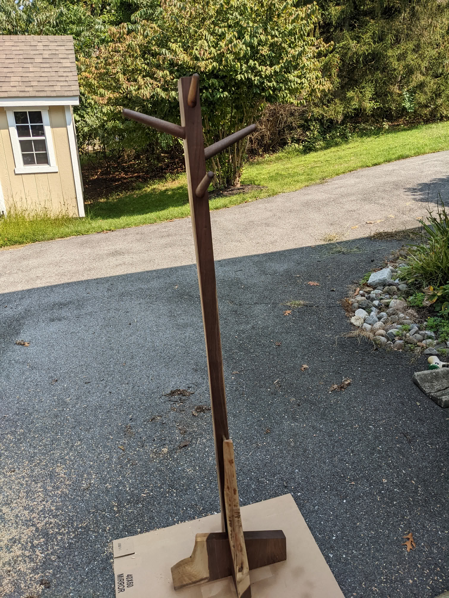
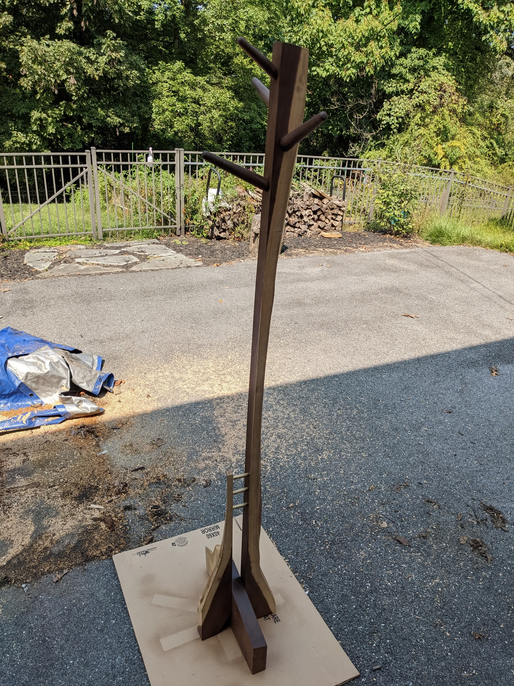
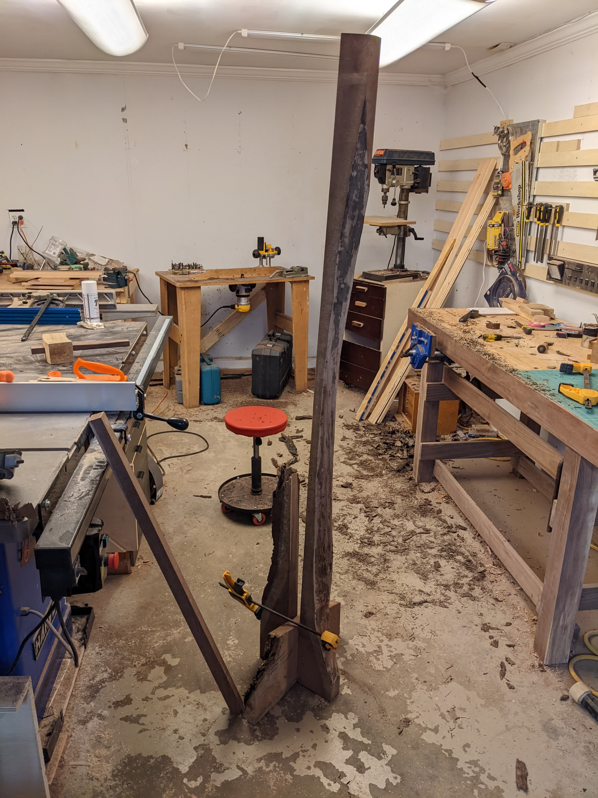
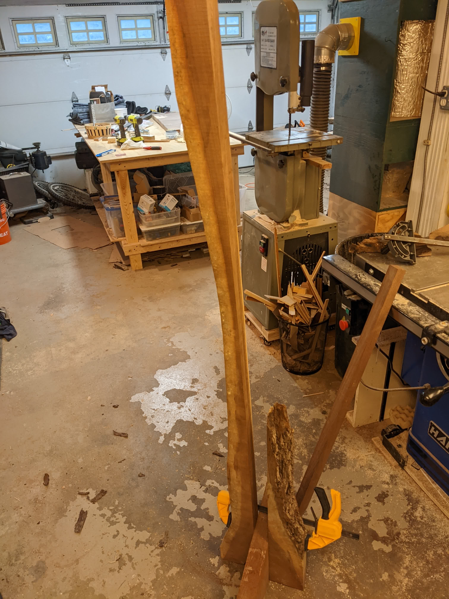
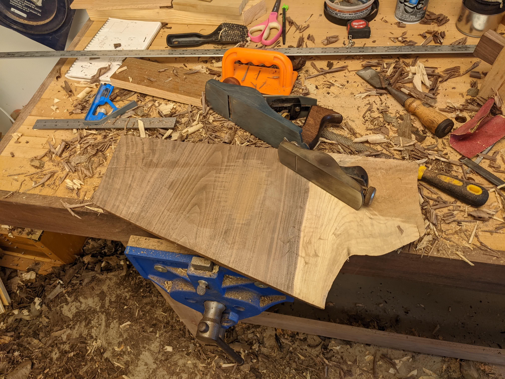
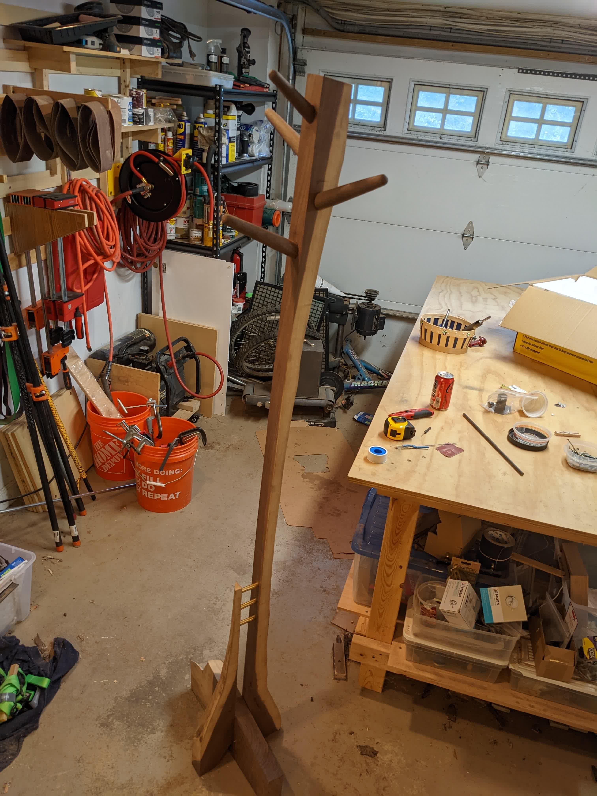

 | 

This coat rack just uses some of the offcut scraps from the walnut table I
recently built.

First, I cleaned up the bark and camped together the pieces into a mockup:

 | 

Then cleaned up the pieces and sanded them a bit.

I forgot to take pictures, but I actually bought a small lathe for this project.
I wanted the pegs to be round, and had some other scrap ready for it but no way
to turn them. So these pegs are my frst forray into woodturning!

They've got a tenon on the end, for which I created a matching angled mortise
in the coat rack. Then I cut a slot + wedge, which seated itself as I drove in
the peg.

I also added some brass rod, which were mostly just to accent with the walnut
but also are glued in and should help a bit structurally.

The dry fit looked alright, so after that just some more sanding + finish!

