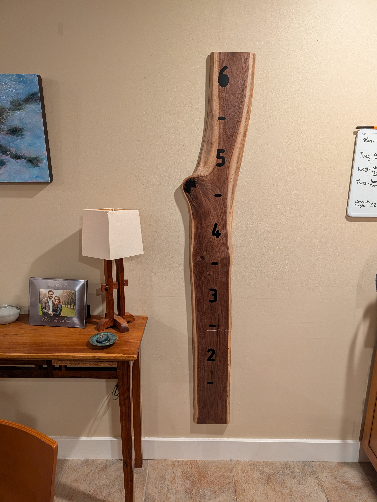
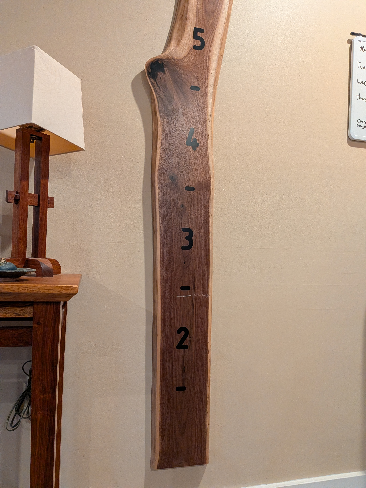
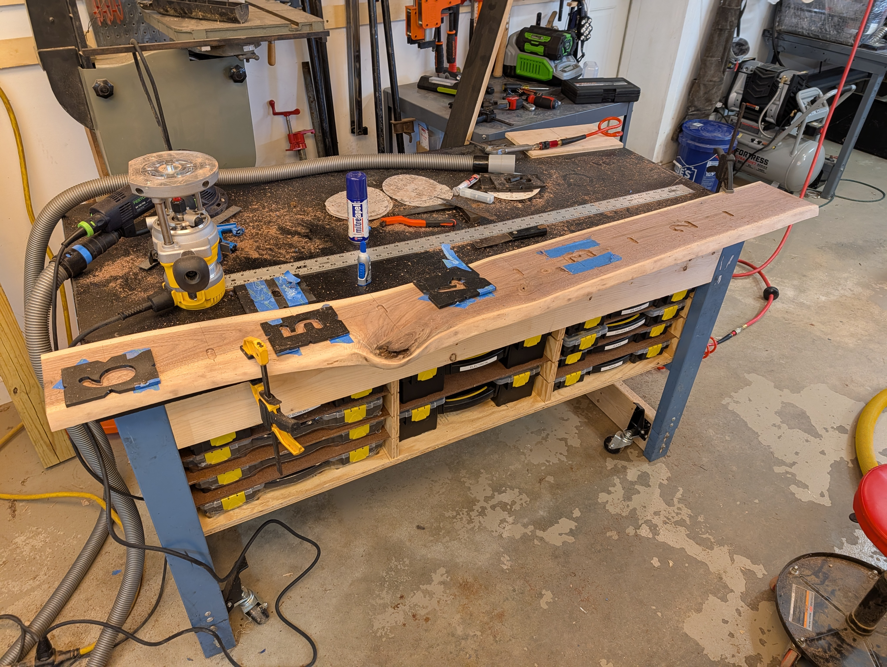
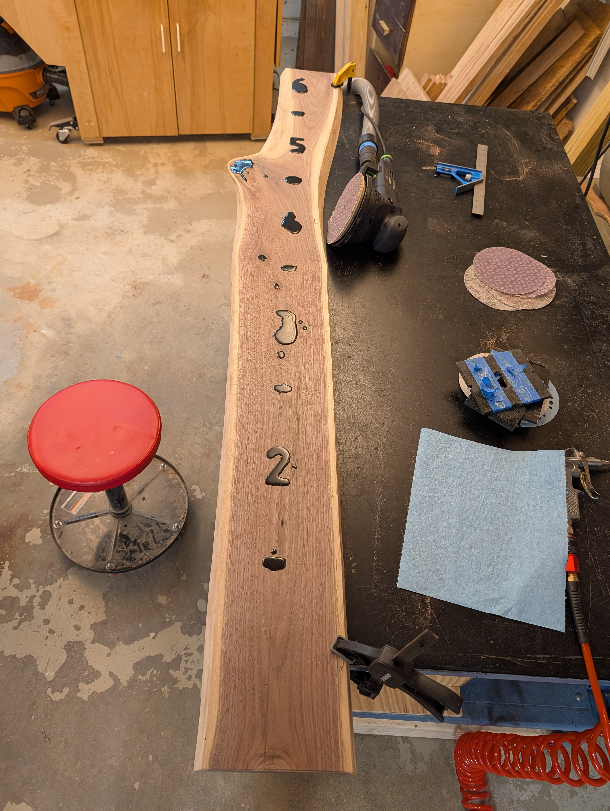
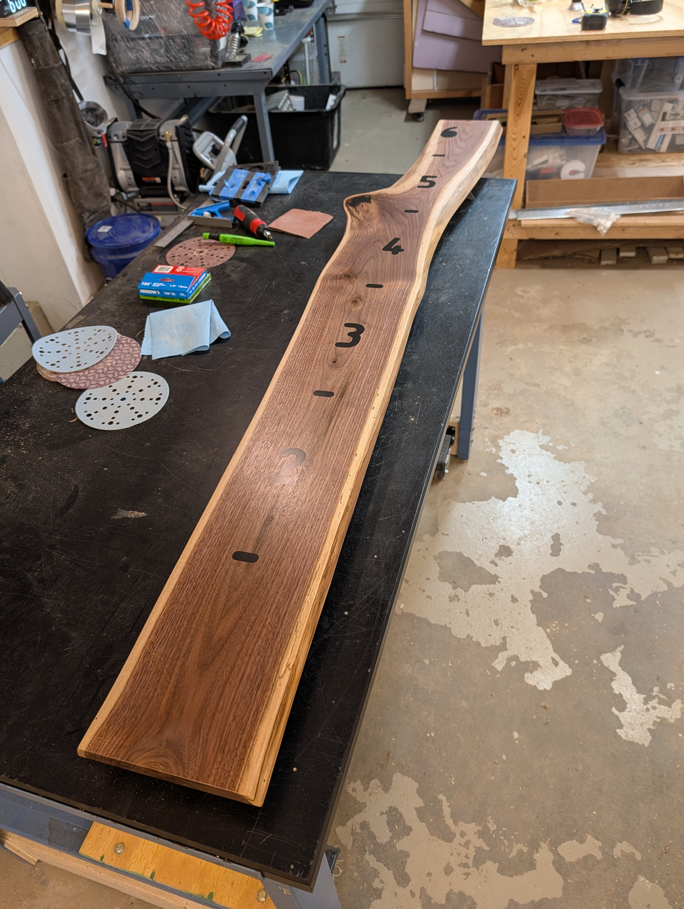
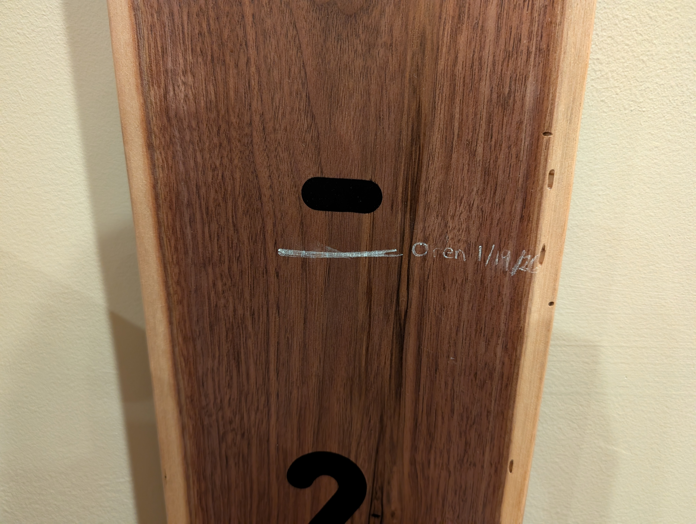

 

!


<!--more-->

_Finished_

I made a height marker!

I started with a rought live edge board. Step 1 was stripping the bark off and flattening it.

I designed/3d printed some router templates for the numbers. I temporarily attached them with painters table + super glue. Once the number was routed, I popped them off.

The next step was setting the epoxy. I dyed the epoxy black and filled in both the numbers and a large void.

After some sanding / finish it was looking pretty good!





