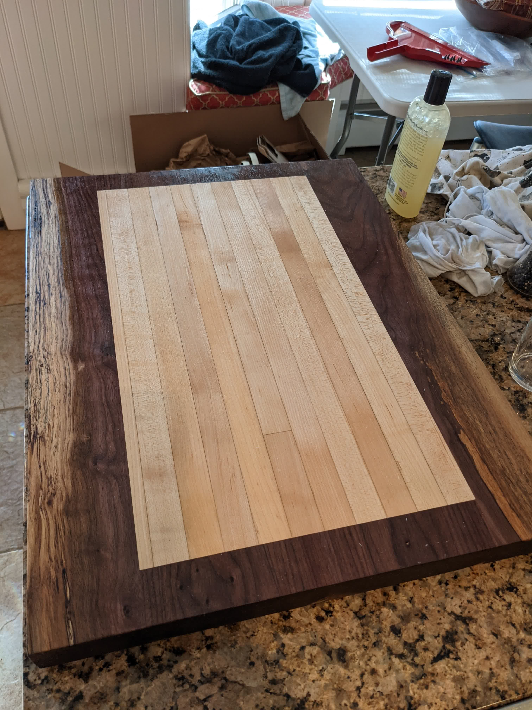
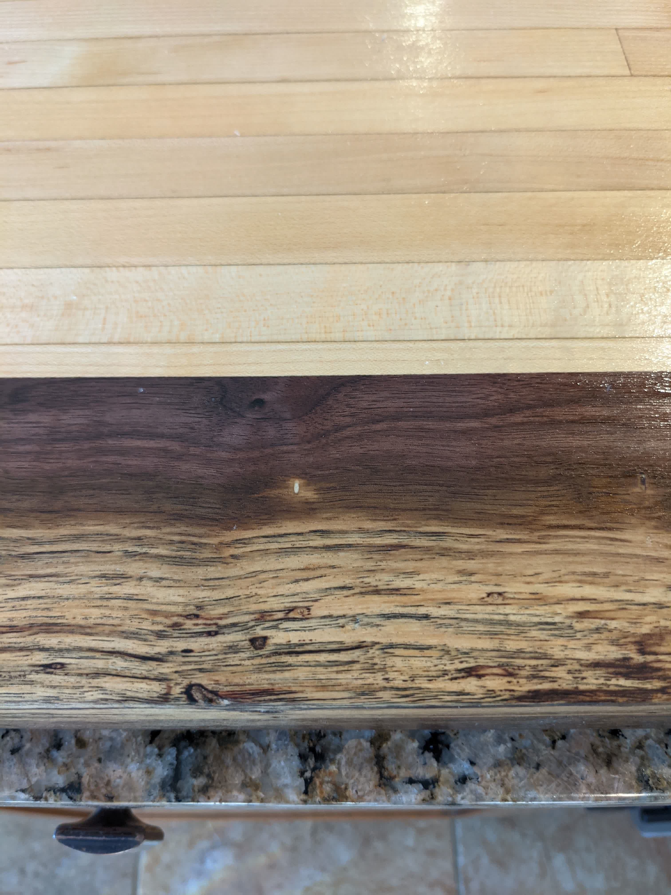
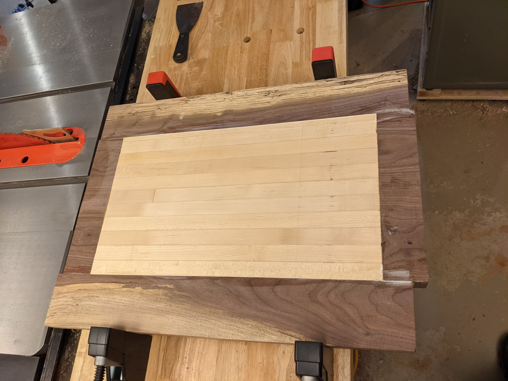
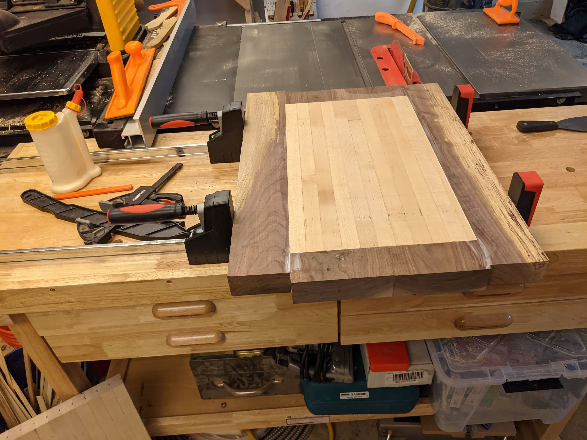




<!--more-->

_Finished_

Having recently made a walnut counter top for a friend, I really wanted my own.
So I made a big cutting board instead. The maple was salvaged from old bowling
lanes I got for free.

