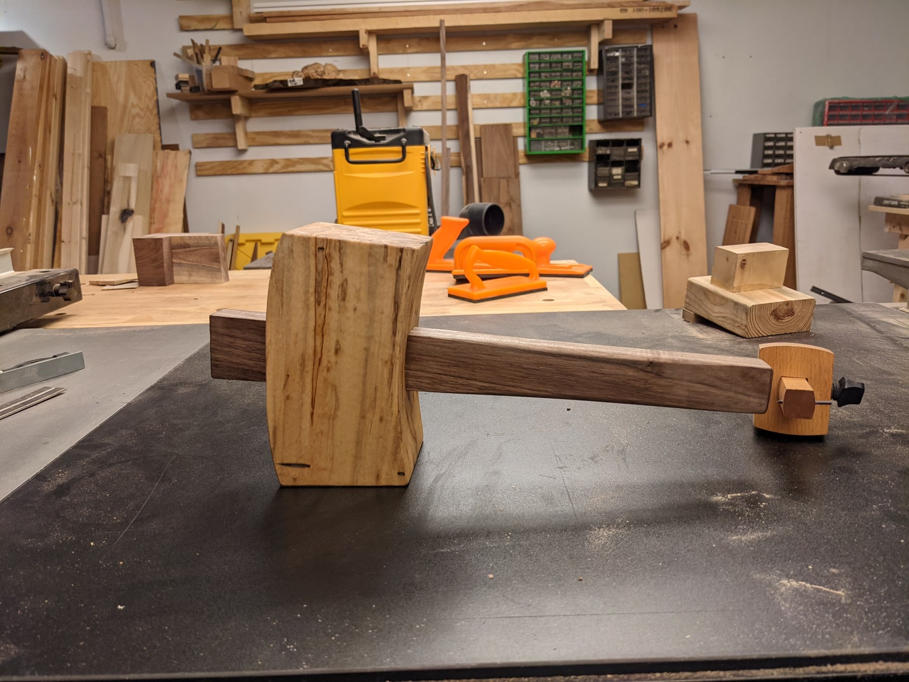
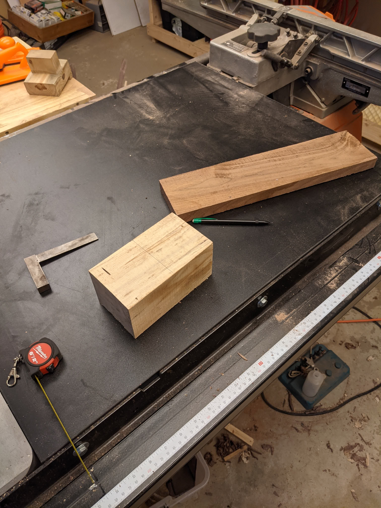
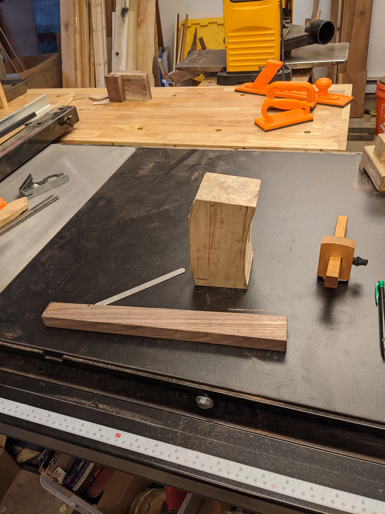
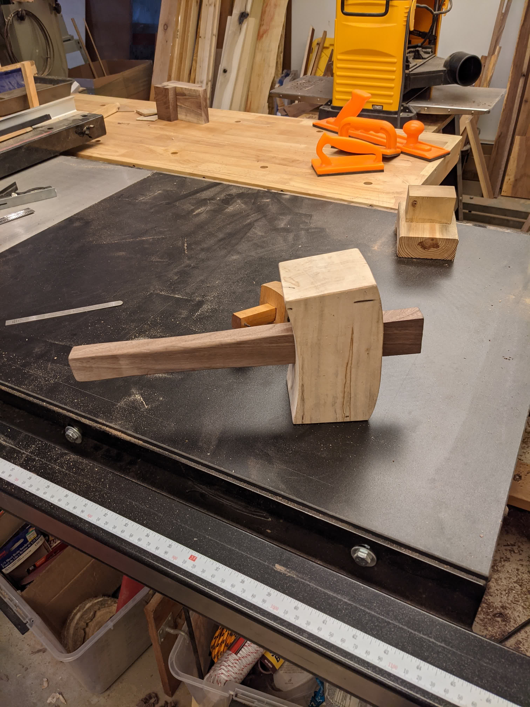
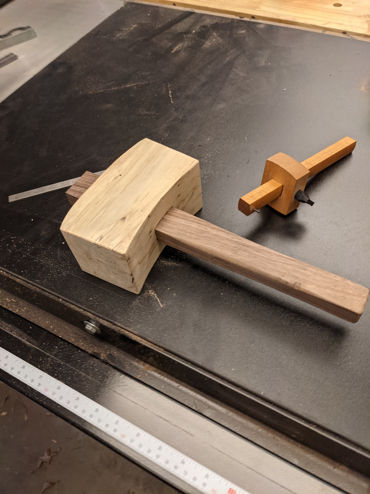
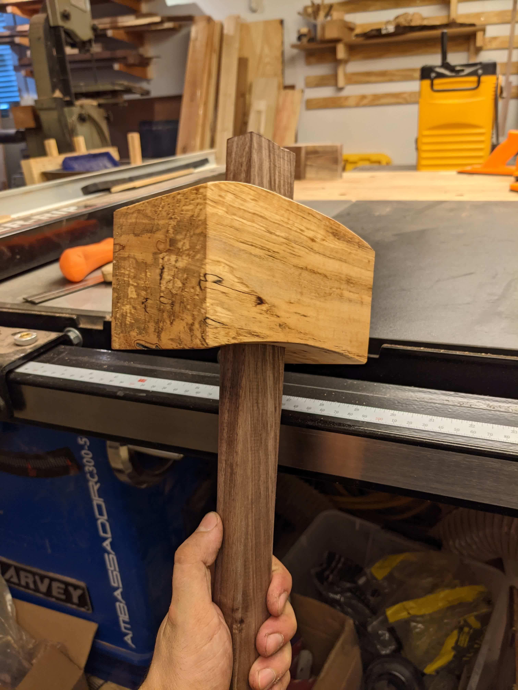
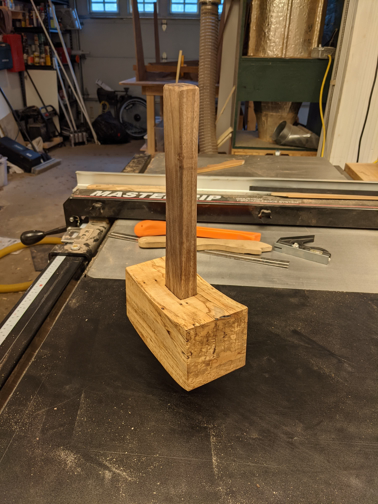
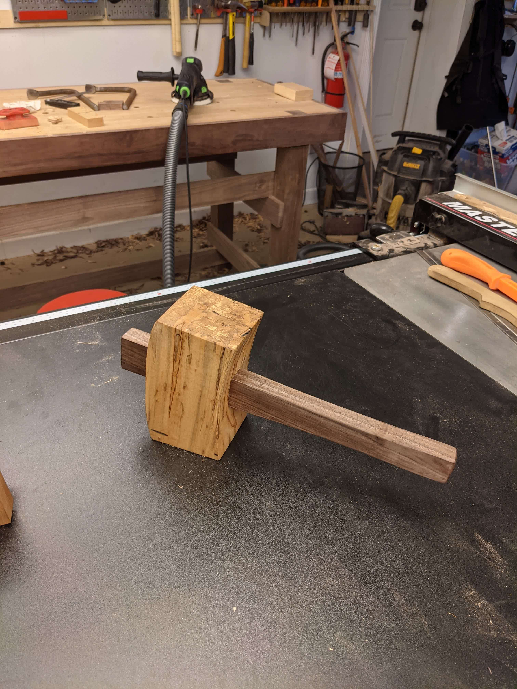

_Finished_

I've been using a rubber mallet and poorly constructed rubber hammer to get
tight joints together and to help with using chisels. They don't work super
well all the time, and I use them enough to warrant some investment in a better
tool.

So I used some scrap walnut and a chunk of maple to create this mallet! It's
based on Paul Sellers' design, and I followed his method of construction as
well (though I used a drill press instead of a mechanical hand drill).

Roughly shaped, next step is cutting out the mortise where the wedge-handle
fit in. I drilled out most of the material using brad bits on my drill press
(not pictured), then used chisels to make the hole the right dimensions to
fit the handle. Just big enough to slide in, tight enough that it'll stay in
place as the wood contracts/expands over time. Also, the handle isn't glued in,
it's just held in place from the wedge + swinging it.

I also did some rough shaping on the lower handle to make it more comfortable
to hold.

And after some finishing touches:

